# 🏥 Doctor Appointment App

A Flutter-based mobile application designed to simplify doctor appointment management by connecting **patients, doctors, and administrators** through a centralized system.

The application provides separate interfaces for patients, doctors, and administrators, with **Firebase Authentication** and **Cloud Firestore** used for authentication and data management.

---

## 📌 Project Overview

The **Doctor Appointment App** provides a digital platform for managing the doctor appointment process.

The system consists of three main modules:

* 👤 **Patient Module** — Find doctors and book appointments.
* 👨‍⚕️ **Doctor Module** — Manage appointments, schedules, and patient information.
* 👨‍💼 **Admin Module** — Manage patients, doctors, appointments, and specializations.

The modules are connected through Firebase, allowing appointment information to be stored and accessed across the system.

---

## 🎯 Problem Statement

Managing doctor appointments manually can be time-consuming and difficult to organize.

Patients need an easy way to view doctors and book appointments, while doctors need a convenient way to manage their appointments and schedules. Administrators also need centralized control over system records.

### Our Solution

The Doctor Appointment App provides:

* A centralized appointment system
* Doctor information and profiles
* Appointment booking
* Doctor schedule and time-slot management
* Patient and doctor management
* Appointment management
* Medical specialization management
* Cloud-based data storage

---

# ✨ Key Features

## 👤 Patient Module

The Patient module allows users to:

* Register and log in
* Access the patient home screen
* View available doctors
* View doctor profiles
* View doctor specializations
* Select available appointment slots
* Book appointments
* View booked appointments
* Manage medical profile
* Submit reviews where supported by the application

### Patient Flow

```text
Login / Register
       ↓
Patient Home
       ↓
View Doctors
       ↓
Doctor Profile
       ↓
Select Time Slot
       ↓
Book Appointment
       ↓
My Appointments
```

---

# 👨‍⚕️ Doctor Module

The Doctor module provides doctors with tools to manage their appointments and availability.

### Features

* Doctor Login
* Doctor Dashboard
* Doctor Profile
* View Appointments
* Appointment Details
* Patient Details
* Schedule Management
* Time-Slot Management

### Doctor Flow

```text
Doctor Login
      ↓
Doctor Dashboard
      ↓
View Appointments
      ↓
Appointment Details
      ↓
Patient Details
      ↓
Schedule / Time Slots
```

---

# 👨‍💼 Admin Module

The Admin module provides centralized management of the application.

### Features

* Admin Dashboard
* Manage Patients
* Manage Doctors
* Manage Appointments
* Manage Specializations
* View system statistics
* Manage doctor information and status

### Admin Flow

```text
Admin Login
     ↓
Admin Dashboard
     ↓
 ┌───────────────┬────────────────┐
 ↓               ↓                ↓
Patients       Doctors       Appointments
                                  │
                                  ↓
                          Specializations
```

---

# 🔄 Complete System Workflow

The three modules communicate through Firebase.

```text
                         DOCTOR APPOINTMENT APP
                                  │
             ┌────────────────────┼────────────────────┐
             ↓                    ↓                    ↓
          PATIENT              DOCTOR                ADMIN
             │                    │                    │
             ↓                    ↓                    ↓
       View Doctors         Doctor Dashboard     Admin Dashboard
             │                    │                    │
             ↓                    ↓                    ├── Patients
       Doctor Profile        Appointments            ├── Doctors
             │                    │                    ├── Appointments
             ↓                    ↓                    └── Specializations
       Select Time Slot     Patient Details
             │
             ↓
      Book Appointment
             │
             ↓
       Cloud Firestore
             │
             ├──────────────────────┐
             ↓                      ↓
          DOCTOR                  ADMIN
             ↓                      ↓
       View Appointment       Manage Appointment
```

### Main Appointment Workflow

1. The patient logs into the application.
2. The patient views available doctors.
3. The patient opens a doctor's profile.
4. The patient selects an available appointment time.
5. The patient books the appointment.
6. Appointment information is stored in Cloud Firestore.
7. The doctor can view the appointment through the Doctor Dashboard.
8. The doctor can access the relevant appointment and patient information.
9. The administrator can view and manage appointment records.

---

# 🔥 Firebase Integration

Firebase is used as the backend service for the application.

## Firebase Authentication

Firebase Authentication is used to authenticate registered users and provide secure login functionality.

## Cloud Firestore

Cloud Firestore is used to store and retrieve application data.

### Main Collections

```text
Firestore
│
├── patients
│
├── doctors
│
├── appointments
│
└── specializations
```

### Data Structure

#### Patients

```text
patients
 ├── name
 └── email
```

#### Doctors

```text
doctors
 ├── name
 ├── specialization
 ├── email
 ├── status
 └── image
```

#### Appointments

```text
appointments
 ├── doctor
 ├── patient
 ├── time
 └── status
```

#### Specializations

```text
specializations
 └── name
```

---

# 🛠️ Technologies Used

| Technology                  | Purpose                                      |
| --------------------------- | -------------------------------------------- |
| **Flutter**                 | Application development                      |
| **Dart**                    | Programming language                         |
| **Firebase Authentication** | User authentication                          |
| **Cloud Firestore**         | Cloud database                               |
| **Git**                     | Version control                              |
| **GitHub**                  | Team collaboration and repository management |
| **Android Studio**          | Development environment                      |

---

# 🏗️ Project Structure

The application is divided into three major modules.

```text
Doctor Appointment App
│
├── Patient Module
│   ├── Login / Register
│   ├── Home
│   ├── Doctor Profiles
│   ├── Appointment Booking
│   ├── Appointments
│   ├── Medical Profile
│   └── Reviews
│
├── Doctor Module
│   ├── Doctor Dashboard
│   ├── Doctor Profile
│   ├── Appointments
│   ├── Appointment Details
│   ├── Patient Details
│   ├── Schedule
│   └── Time Slots
│
└── Admin Module
    ├── Admin Dashboard
    ├── Manage Patients
    ├── Manage Doctors
    ├── Manage Appointments
    └── Specializations
```

---

# 📱 Application Screenshots

Screenshots demonstrating the main application interfaces are included below.

## Patient Module

### Patient Home

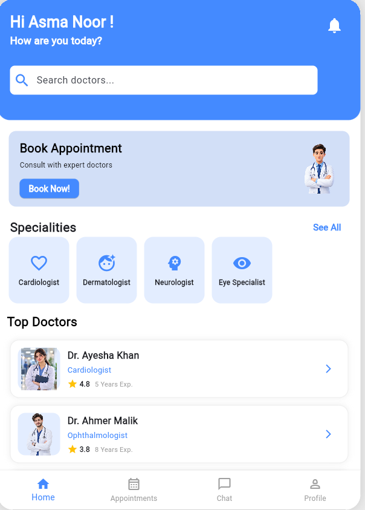

### Doctor Profile

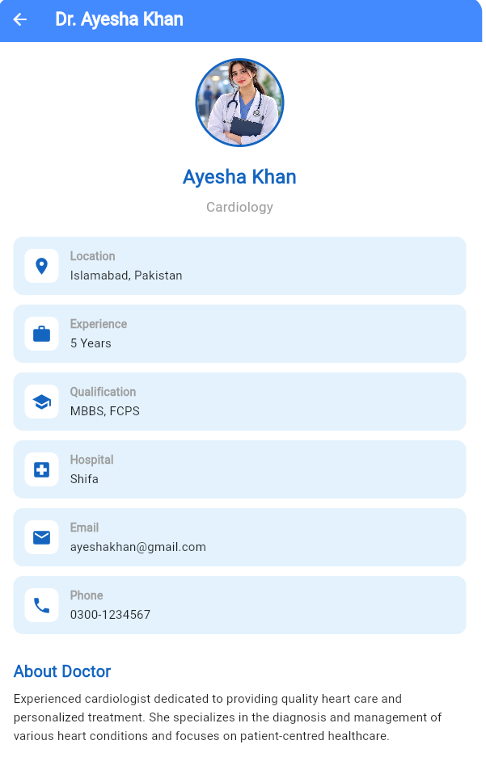

### Appointment Booking

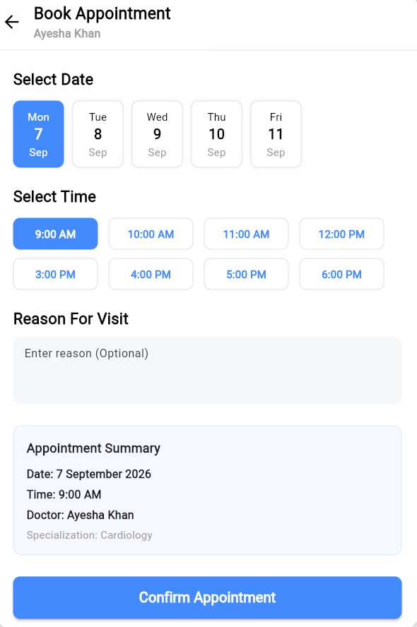

### My Appointments

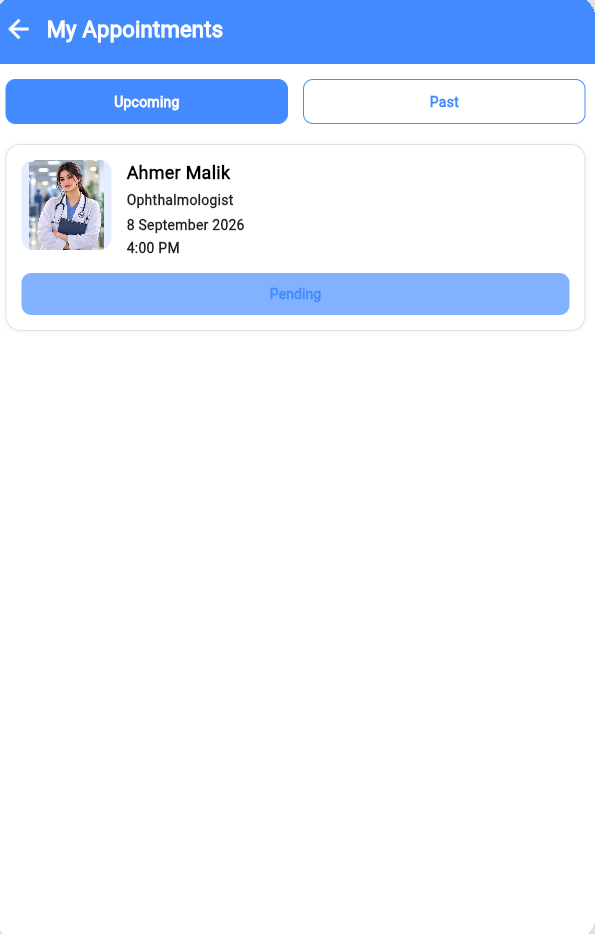

---

## Doctor Module

### Doctor Dashboard

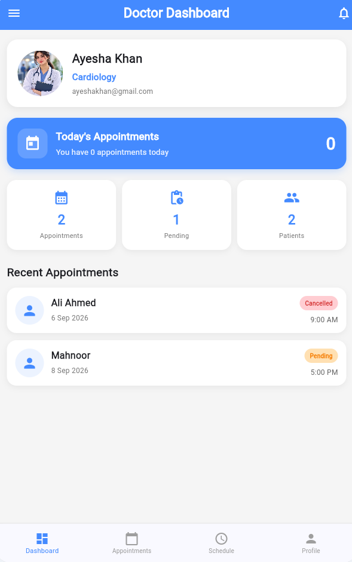


### Doctor Appointments

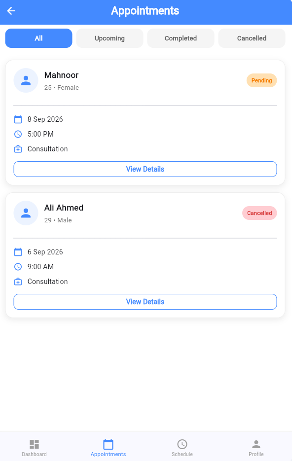


### Appointment Details

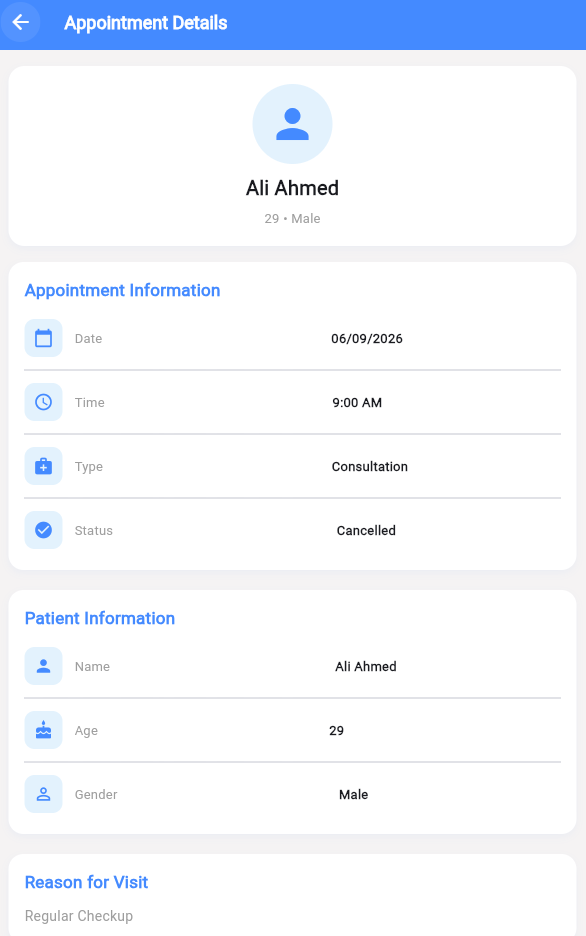
### Schedule / Time Slots

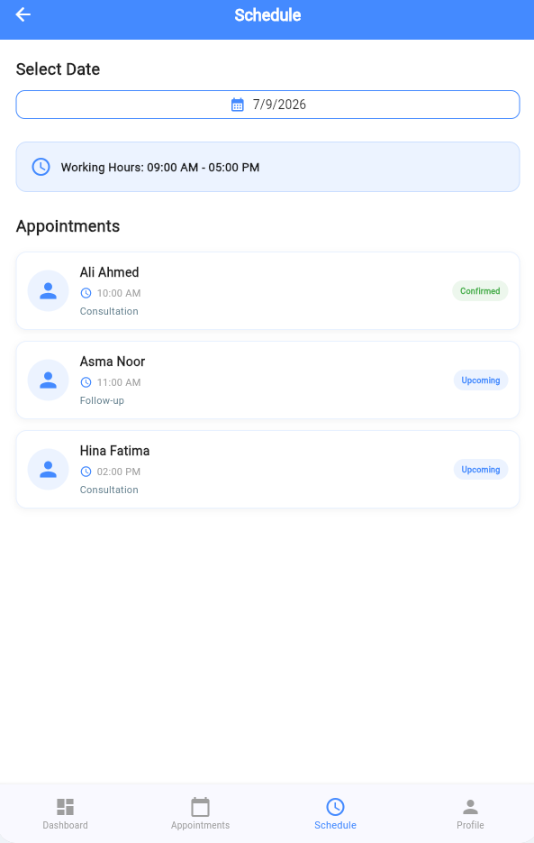
---

## Admin Module

### Admin Dashboard

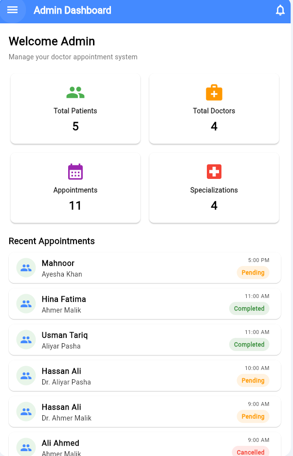

### Manage Patients

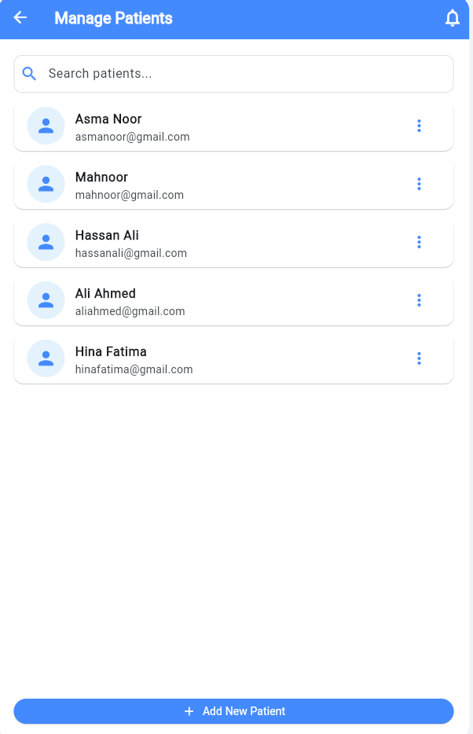

### Manage Doctors

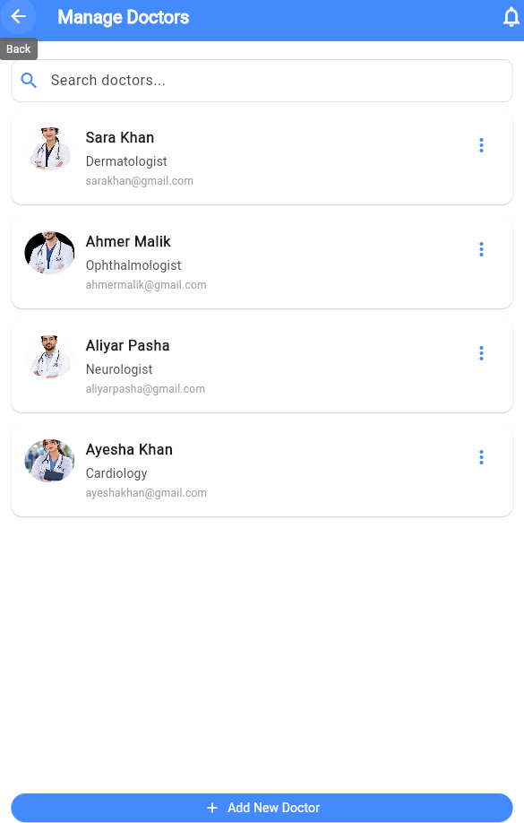


### Manage Appointments

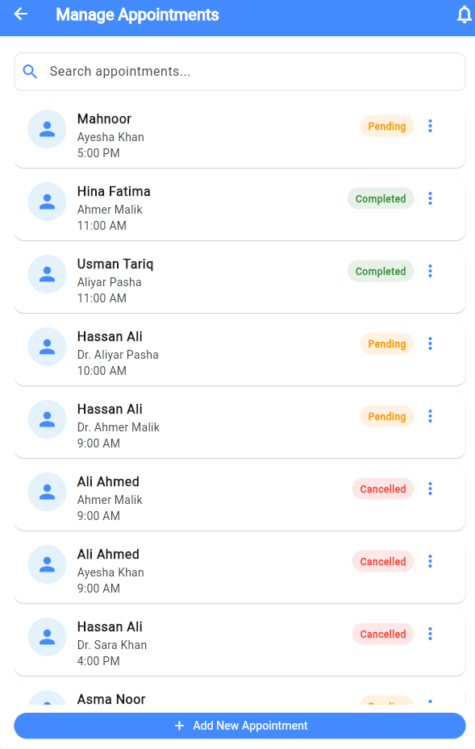


### Specializations

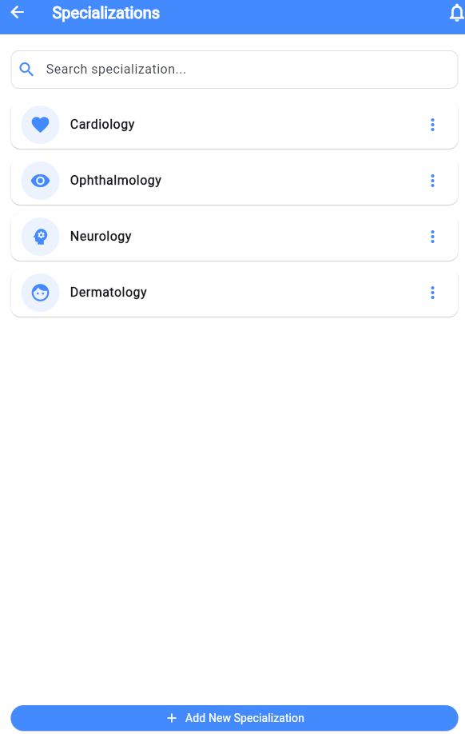

---

# 🚀 Getting Started

## Prerequisites

Make sure the following are installed:

* Flutter SDK
* Dart SDK
* Android Studio
* Android device or emulator
* Firebase project

---

## Installation

### 1. Clone the Repository

```bash
git clone YOUR_GITHUB_REPOSITORY_URL
```

### 2. Open the Project

```bash
cd doctor-appointment-app
```

### 3. Install Dependencies

```bash
flutter pub get
```

### 4. Configure Firebase

Configure the project with your Firebase project using the required FlutterFire configuration files.

### 5. Run the Application

```bash
flutter run
```

---

# 📦 Building the APK

To generate a release APK:

```bash
flutter build apk --release
```

The APK will be generated at:

```text
build/app/outputs/flutter-apk/app-release.apk
```

---

# 👥 Team Contributions

| Team Member         | Module         | Main Contributions                                                                                         |
| ------------------- | -------------- | ---------------------------------------------------------------------------------------------------------- |
| **[ Sawera]** | Patient Module | Login/Register, Patient Home, Doctor Profiles, Appointment Booking, Appointments, Medical Profile, Reviews |
| **[ Toseefa Rafique]** | Doctor Module  | Doctor Dashboard, Doctor Profile, Appointments, Appointment Details, Schedule, Time Slots, Patient Details |
| **[Samara Minahil]**     | Admin Module   | Admin Dashboard, Manage Patients, Manage Doctors, Manage Appointments, Specializations                     |

---

# 🎯 Project Objectives

The main objectives of this project are:

* To simplify doctor appointment booking.
* To provide patients with accessible doctor information.
* To allow doctors to manage appointments and schedules.
* To provide centralized administrative management.
* To store application information using a cloud database.
* To create an organized and user-friendly appointment system.
* To connect different user roles through a shared backend.

---

# 🔐 Security

The application uses Firebase Authentication for user authentication.

Firestore security rules should be configured according to the application's access requirements before production deployment.

**Important:** Private passwords, Firebase service-account credentials, and other sensitive information should not be uploaded to the public GitHub repository.

---

# 🧪 Testing

The application has been tested across its main user workflows, including:

* Patient authentication
* Doctor authentication
* Admin authentication
* Doctor viewing
* Appointment booking
* Appointment retrieval
* Doctor appointment management
* Patient information access
* Admin management screens
* Firebase/Firestore data integration

The complete workflow can be demonstrated using separate accounts for the Patient, Doctor, and Admin roles.

---

# 🔮 Future Enhancements

The following features can be considered for future versions:

* Online payment integration
* Push notifications
* Appointment reminders
* Video consultation
* Prescription management
* Medical document management
* Advanced appointment availability handling
* Enhanced reporting and analytics

---

# 📚 Learning Outcomes

Through this project, the team gained practical experience in:

* Flutter development
* Dart programming
* Firebase Authentication
* Cloud Firestore
* CRUD operations
* Mobile application UI development
* Git and GitHub
* Team-based software development
* Multi-role application design
* Cloud database integration

---

# ⭐ Conclusion

The **Doctor Appointment App** provides an integrated platform for patients, doctors, and administrators.

Patients can view doctors and book appointments, doctors can manage appointments and schedules, and administrators can manage important system records.

By combining **Flutter, Dart, Firebase Authentication, and Cloud Firestore**, the project demonstrates a complete multi-role application with a connected cloud backend.

---

## 📄 Project Information

**Project:** Doctor Appointment App
**Project Type:** Final Year Project (FYP)
**Framework:** Flutter
**Language:** Dart
**Backend:** Firebase
**Database:** Cloud Firestore
**Platform:** Android / Web

**GitHub Repository:**
